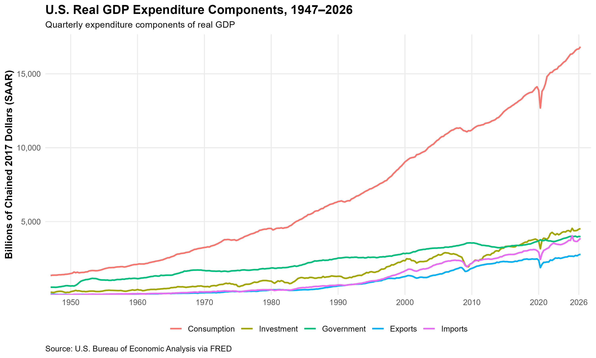
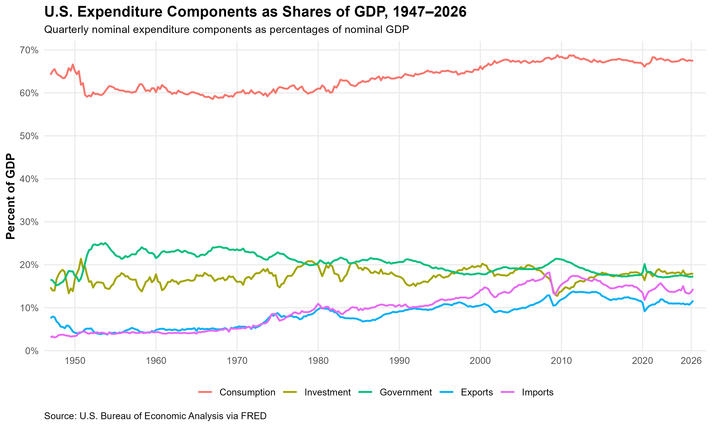

# U.S. GDP Expenditure Analysis in R

## Overview

This project analyzes the major expenditure components of U.S. real GDP using quarterly data from 1947 through 2026.

The analysis was conducted in R and examines both the level of major expenditure components and how their shares of real GDP have changed over time.

## Research Question

How has the composition of U.S. real GDP changed over time?

## Components Analyzed

The analysis focuses on:

- Consumption
- Investment
- Government consumption expenditures and gross investment
- Exports
- Imports
- Net exports

## Data Sources

Data are from the U.S. Bureau of Economic Analysis (BEA), accessed through Federal Reserve Economic Data (FRED).

Two types of quarterly data are used in this project:

- **Real expenditure series** are measured in billions of chained 2017 dollars at seasonally adjusted annual rates. These series are used to compare the real levels of GDP expenditure components over time.
- **Nominal expenditure series** are measured in billions of current dollars at seasonally adjusted annual rates. These series are used to calculate expenditure shares of GDP.

### Real Series

- GDPC1 — Real Gross Domestic Product
- PCECC96 — Real Personal Consumption Expenditures
- GPDIC1 — Real Gross Private Domestic Investment
- GCEC1 — Real Government Consumption Expenditures and Gross Investment
- EXPGSC1 — Real Exports of Goods and Services
- IMPGSC1 — Real Imports of Goods and Services

### Nominal Series

- GDP — Gross Domestic Product
- PCEC — Personal Consumption Expenditures
- GPDI — Gross Private Domestic Investment
- GCE — Government Consumption Expenditures and Gross Investment
- EXPGS — Exports of Goods and Services
- IMPGS — Imports of Goods and Services


## Tools and Skills

- R
- tidyverse
- ggplot2
- readxl
- janitor
- Data cleaning
- Data transformation
- Economic time-series analysis
- Data visualization
- Git and GitHub

## Data Processing

The analysis uses separate real and nominal datasets for different purposes.

The R workflow:

1. Imports the original real expenditure data from Excel.
2. Cleans variable names and removes non-data rows.
3. Converts the economic variables to numeric format.
4. Uses real expenditure series to analyze the long-run levels of consumption, investment, government expenditure, exports, and imports.
5. Imports six nominal/current-dollar series from FRED.
6. Merges the nominal series by quarterly observation date.
7. Calculates consumption, investment, government, export, and import shares of nominal GDP.
8. Calculates net exports and the net exports share of GDP.
9. Reshapes the data for visualization using `pivot_longer()`.
10. Produces reproducible time-series visualizations with `ggplot2`.

Real chained-dollar series are used for comparing expenditure levels over time, while nominal current-dollar series are used for calculating GDP shares.

## Real Expenditure Components

The figure below shows the long-run evolution of real consumption, investment, government consumption expenditures and gross investment, exports, and imports. The series are measured in billions of chained 2017 dollars at seasonally adjusted annual rates.




## Expenditure Shares of GDP

The second figure shows each expenditure component as a percentage of nominal GDP. These shares are calculated using the current-dollar expenditure series rather than the chained-dollar real series.



## Key Findings

- Consumption is the largest expenditure component throughout the sample period, accounting for roughly two-thirds of nominal GDP in recent decades.
- Consumption's share of GDP generally increased over the long run, although the change was gradual rather than constant.
- Investment is substantially more volatile than consumption and shows clear cyclical fluctuations, including sharp declines during major downturns.
- Government consumption expenditures and gross investment rose sharply as a share of GDP during the early postwar period and later settled at a lower, relatively stable share.
- Both exports and imports increased substantially as shares of GDP over the long run, indicating greater integration of the U.S. economy with international trade.
- Imports have exceeded exports during much of the modern period, producing negative net exports.


## Repository Structure

```text
US-GDP-expenditure-analysis/
│
├── README.md
├── gdp_analysis.R
│
├── data/
│   ├── gdp_source.xlsx
│   ├── gdp_processed.csv
│   ├── GDP.csv
│   ├── PCEC.csv
│   ├── GPDI.csv
│   ├── GCE.csv
│   ├── EXPGS.csv
│   └── IMPGS.csv
│
├── figures/
│   ├── expenditure_components.png
│   └── expenditure_shares.png
│
├── report/
│
└── US GDP expenditure analysis.Rproj


## Reproducibility

The complete R workflow is contained in `gdp_analysis.R`.

The script:

- imports and cleans the real expenditure data,
- imports the six nominal FRED series,
- merges the nominal datasets by quarterly date,
- calculates expenditure shares of nominal GDP,
- calculates net exports,
- reshapes the data for visualization,
- and reproduces both figures contained in the `figures` folder.

The project can be reproduced by opening the RStudio project file and running `gdp_analysis.R` from top to bottom.

## Author

Fahim Khan  
M.A. Quantitative Business Economics, UNLV